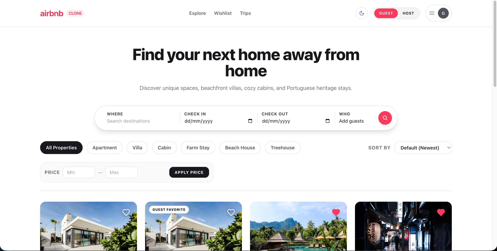
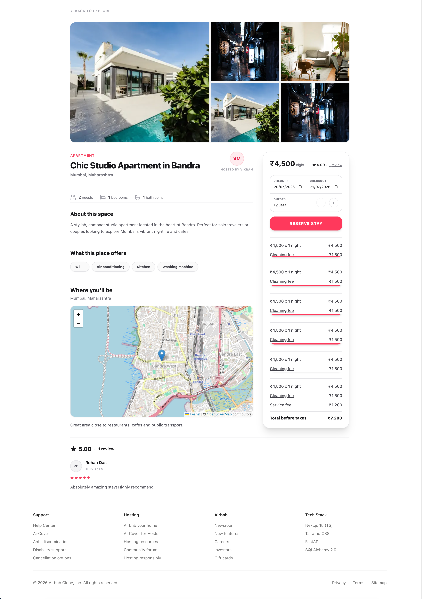
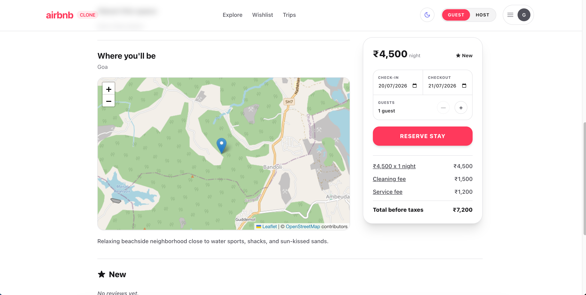
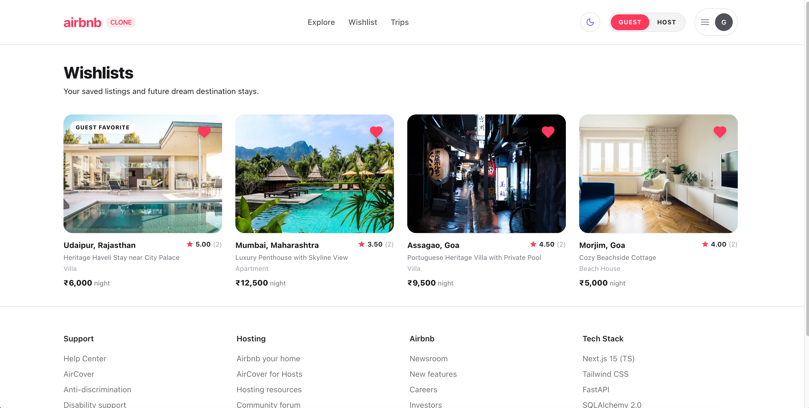
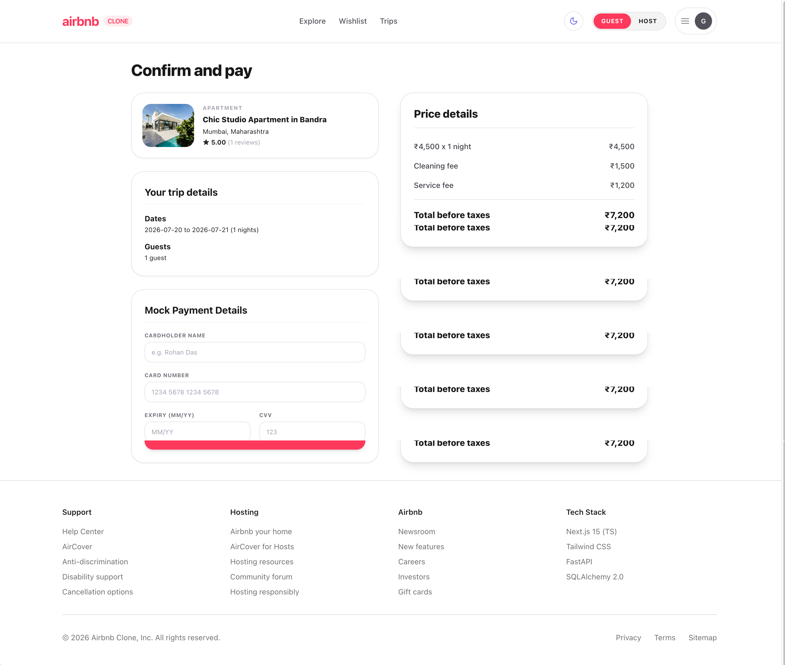
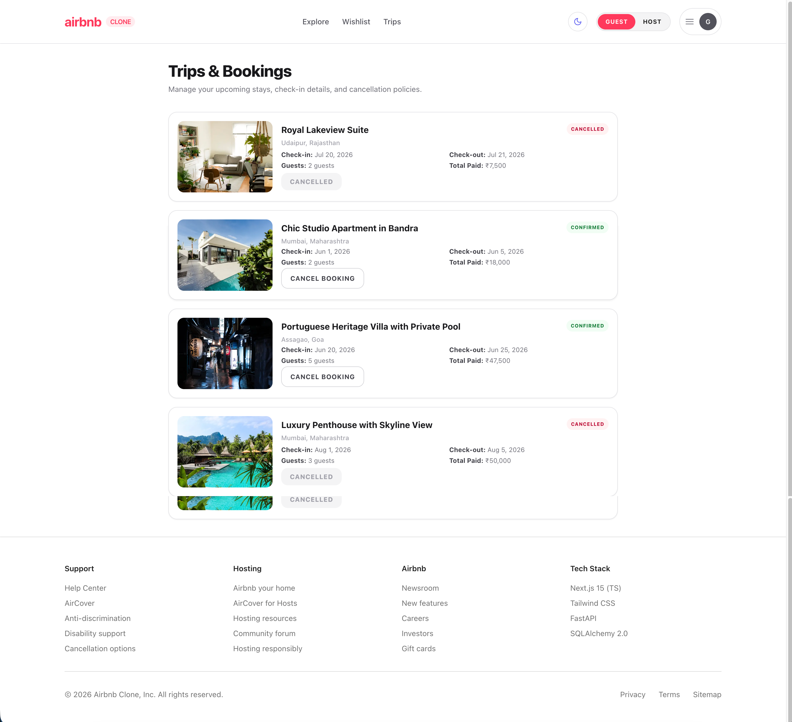
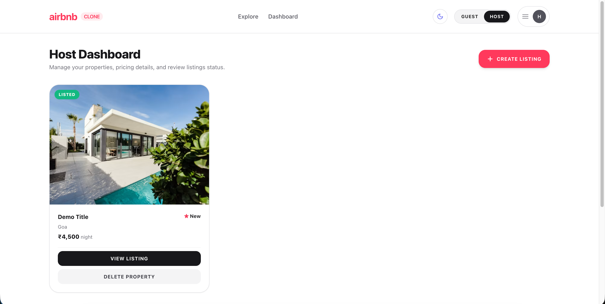
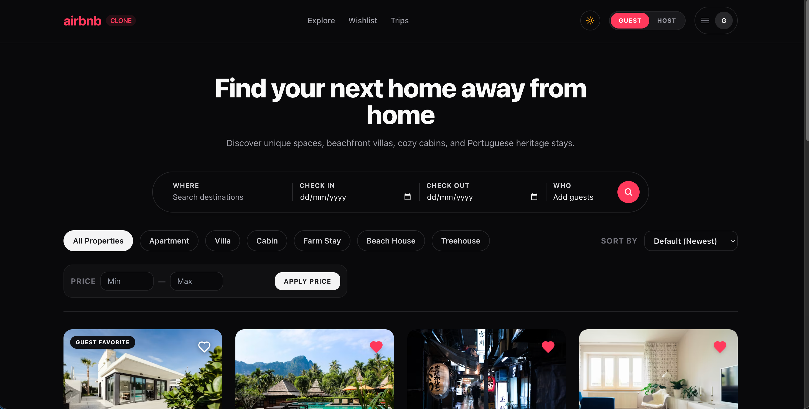
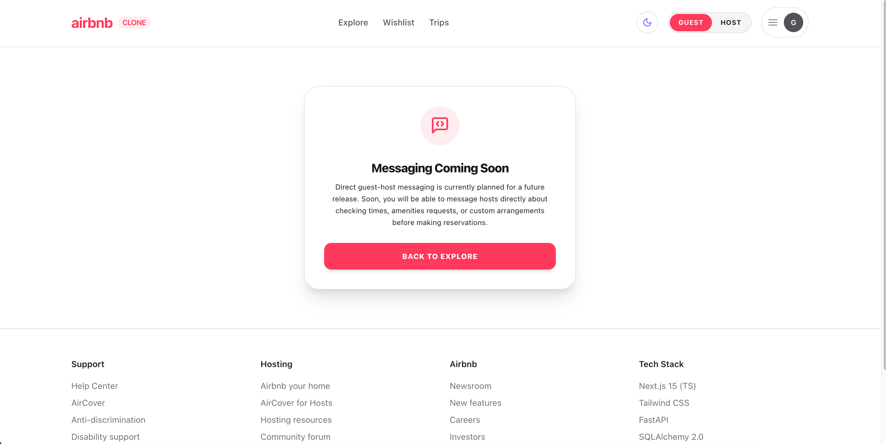

# Airbnb Clone — Demo Walkthrough

This document walks through the key features of the Airbnb Clone application with screenshots.

---

## 1. Landing Page

The homepage displays a paginated grid of accommodation listings. Guests can use the top search bar to filter by location or keyword, and adjust filters for property type, price, and sort order.

---

## 2. Viewing a Listing

Clicking any property card opens its detail page. This includes:

- A **photo gallery** with full-width imagery
- Key details — property type, guests, bedrooms, bathrooms, rating
- A scrollable **amenities** section
- Guest **reviews** with star ratings
- An **interactive map** showing the property location
- A sticky **booking widget** on the right (desktop) or inline (mobile)

---

## 3. Interactive Map

Every listing detail page includes an embedded OpenStreetMap map centred on the property location. This uses the Leaflet library with a custom pin marker.

---

## 4. Wishlist

Guests can save listings by clicking the **heart icon** on any listing card. Hearts toggle instantly with real-time state updates.

The dedicated **Wishlist page** displays all saved properties in a grid. Each card retains the heart toggle for easy removal.

---

## 5. Booking Flow (Mock Checkout)

From the listing detail page, selecting dates and a guest count and clicking **Reserve** navigates to the mock checkout page. The checkout page shows a booking summary including:

- Listing title and thumbnail
- Check-in and check-out dates
- Number of guests
- Price breakdown (nightly rate × nights + platform fee)
- Payment form (mock)

---

## 6. Trips — Viewing & Cancelling Bookings

After a booking is confirmed, it appears in the **Trips** page. Each trip card shows:

- Property name, location, and thumbnail
- Check-in and check-out dates
- Total price
- Booking status (Confirmed / Cancelled)
- A **Cancel Booking** button (for confirmed bookings)

Cancelling a booking sends a `PATCH /bookings/{id}/cancel` request and immediately updates the card status to **Cancelled**.

---

## 7. Host Dashboard

Switching to **Host** mode via the role switcher reveals the Host Dashboard. The dashboard lists all properties owned by the host, each showing the listing title, location, nightly price, rating, and a delete button.

Hosts can click **Create Listing** to open a modal form and add a new property. Newly created listings appear in the dashboard immediately and are also discoverable in the Explore feed.

---

## 8. Dark Mode

The application fully supports **light**, **dark**, and **system** themes via the sun/moon toggle in the navbar. All pages, components, and modals adapt correctly to both themes.

---

## 9. Placeholder Pages

Pages that are planned for future releases display clean placeholder states that match the application's design language. The **Messages** page is one such example.

---

## 10. Summary

The Airbnb Clone demonstrates a complete full-stack booking platform with:

| Feature | Status |
|---------|--------|
| Listing browse, search, filter, and paginate | ✅ Implemented |
| Listing detail with gallery, amenities, reviews, map | ✅ Implemented |
| Wishlist with real-time toggle | ✅ Implemented |
| Mock checkout and booking creation | ✅ Implemented |
| Trips view and booking cancellation | ✅ Implemented |
| Host dashboard with create and delete | ✅ Implemented |
| Dark mode | ✅ Implemented |
| Fully responsive mobile UI | ✅ Implemented |
| Messages (guest–host) | 🔜 Planned |
| Identity verification | 🔜 Planned |
